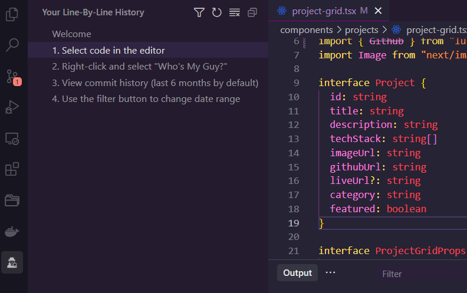
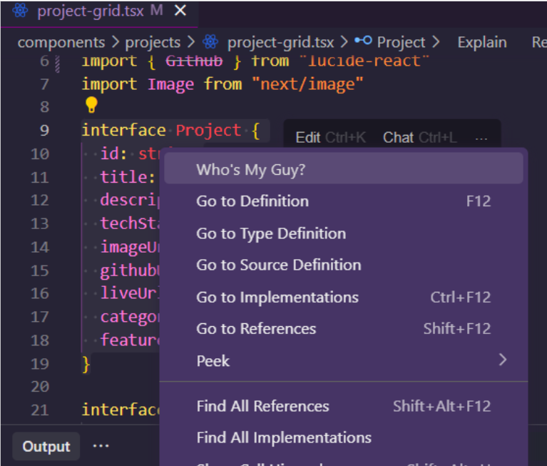
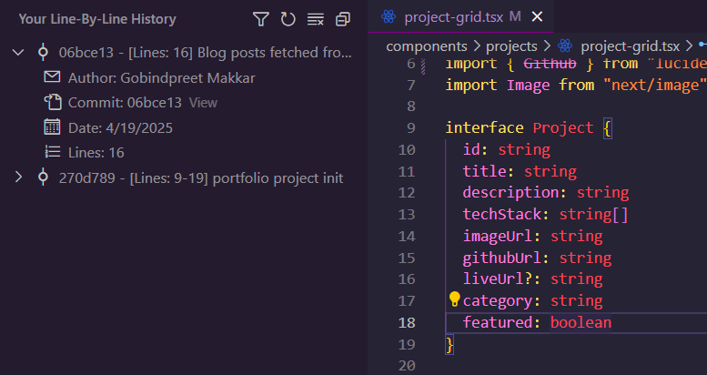

# Who's My Guy

Available at [VS Code Marketplace](https://marketplace.visualstudio.com/items?itemName=GobindpreetMakkar.whosmyguy)

## Overview

"Who's My Guy" is a powerful Visual Studio Code extension that enhances your Git history experience. It provides a more comprehensive view of code authorship by collecting and combining Git history for each line, going beyond what a standard Git blame would offer.

## Features

- **Enhanced Git History**: Get a more detailed history of each line of code.
- **Easy-to-Use**: Simply select a piece of code and access the feature from the right-click menu.
- **Information Panel**: View the collected Git history in a convenient panel on the right side of your editor.
- **Comprehensive History**: See more than just the last commit for each line.

## Usage

1. Select a piece of code in your editor
2. Right-click to open the context menu
3. Choose the "Who's My Guy" command
4. An information panel will open with all the details

## Example Results

### Switching the Context Menu Title

You can now choose your preferred title for the context menu action:

1.  Open the **Command Palette** (usually `Ctrl+Shift+P` or `Cmd+Shift+P`).
2.  Search for and run the command: `Switch between 'Who's My Guy/Gal' Context Menu Title`.
3.  An information message will confirm the change.
4.  The next time you right-click in the editor, the new title will appear in the context menu.
    Your preference is saved and will be remembered across VS Code sessions.

### Known Issues

Please report any issues you encounter on my GitHub repository.

### Support

If you encounter any problems or have any questions, please open an issue on our GitHub repository or shoot me a message.

---

Happy coding, and may you always know who your guy/gal is! 👨‍💻👩‍💻
